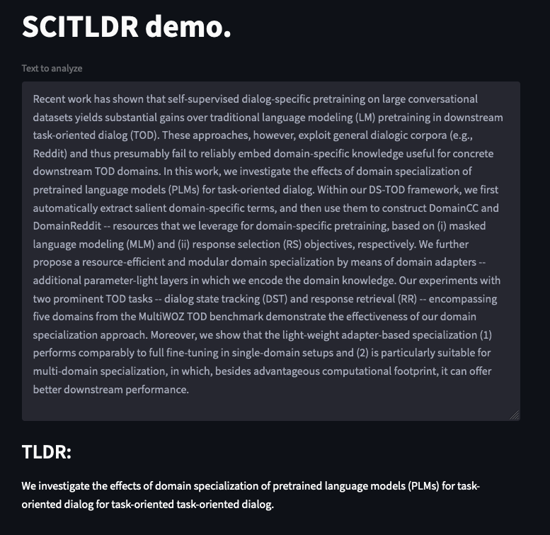

# Demo for research paper summarization.


## Installation

### Get a model

Contact (`model.state`) from me.


### Setup env

```
poetry install
```

In the case that you don't use [Poetry](https://python-poetry.org/), I also put `requirements.txt` but it's not tested.
So instead of the command above, you can try,

```bash
pip install requirements.txt
```


## Start the app

```bash
> poetry run streamlit run scitldr_streamlit/main.py
```


Should get something like this.


